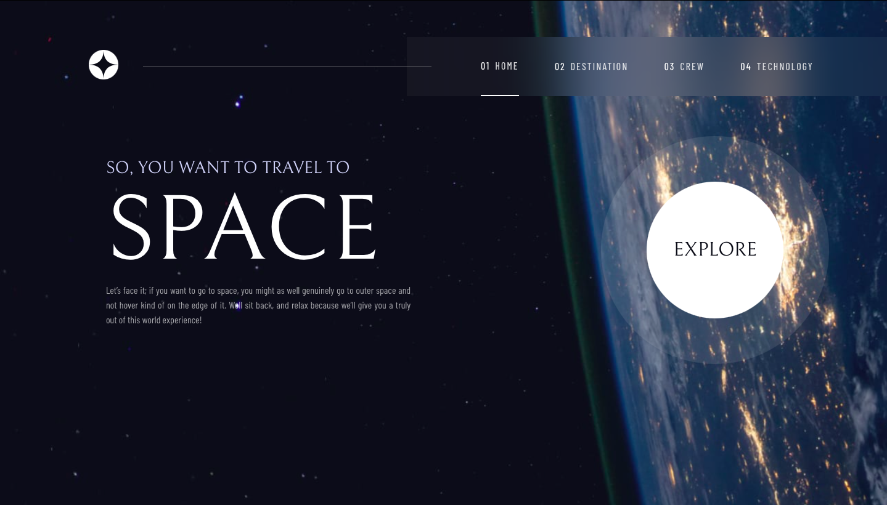

# Frontend Mentor - Space Tourism Website solution

This is a solution to the [Space tourism website challenge on Frontend Mentor](https://www.frontendmentor.io/challenges/space-tourism-multipage-website-gRWj1URZ3).  Frontend Mentor challenges help you improve your coding skills by building realistic projects. 

## Table of contents

- [Overview](#overview)
  - [The Challenge](#the-challenge)
  - [Screenshot](#screenshot)
  - [Links](#links)
- [My process](#my-process)
  - [Built with](#built-with)
- [Author](#author)
- [References](#references)

## Overview

### The challenge

Users should be able to:

- View the optimal layout for each of the website's pages depending on their device's screen size
- See hover states for all interactive elements on the page
- View each page and be able to toggle between the tabs to see new information

### Screenshot

### Links

- Solution URL: [repository](https://github.com/ArcidesFerrao/space-website)
- Live Site URL: [github-pages](https://arcidesferrao.github.io/space-website/)

## My process

### Built with

- Semantic HTML5 markup
- CSS custom properties
- Flexbox
- [React](https://reactjs.org/) - JS library
- [Vite](https://vitejs.dev/guide/)

## Author

- Frontend Mentor - [@ArcidesFerrao](https://www.frontendmentor.io/profile/ArcidesFerrao)
- Twitter - [@Arcides_](https://www.twitter.com/Arcides_)

# References

1. [@vitejs/plugin-react](https://github.com/vitejs/vite-plugin-react/blob/main/packages/plugin-react/README.md) uses [Babel](https://babeljs.io/) for Fast Refresh

4. [Deploying a React App* to GitHub Pages](https://github.com/gitname/react-gh-pages)
